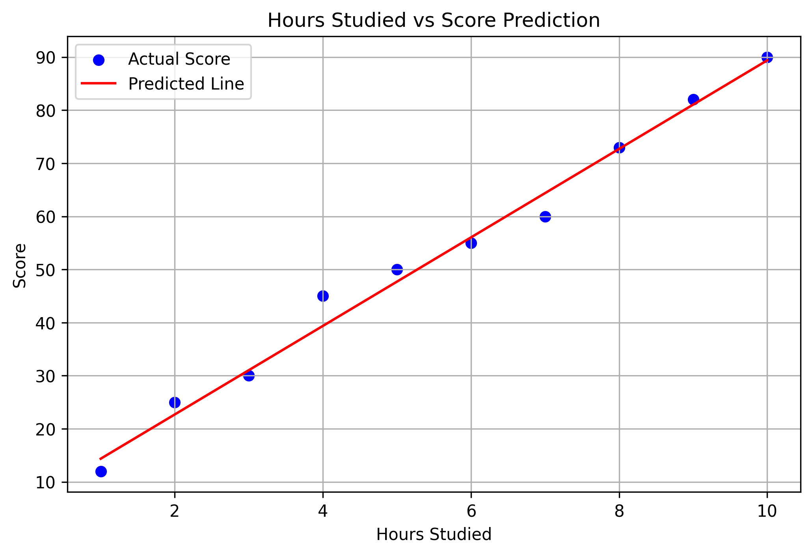
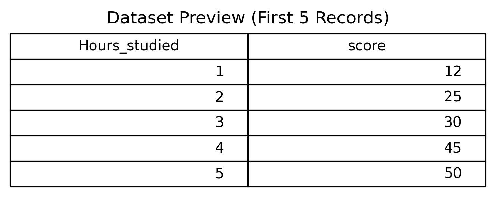
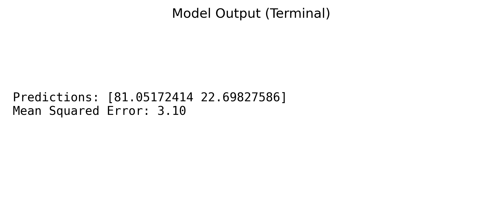

# 🎯 ML-Student-Score-Prediction

<p align="center">
  Predict student scores based on hours studied using Linear Regression
</p>

<p align="center">
  
  
  
  
</p>

---

## 🔥 Tagline
**"Turn study hours into score predictions with ML magic!"** ✨

---

## 📝 Project Description
This is a **Machine Learning (Linear Regression) project** that predicts a student's score based on their study hours.  
It demonstrates a complete workflow including:

- ✅ Data preparation & visualization  
- ✅ Linear Regression model training  
- ✅ Predictions & error evaluation  
- ✅ Generating high-quality visual assets for GitHub portfolio  

Perfect for **hackathons, ML portfolios, or learning projects**.

---

## 📊 Demo Visuals

### 1️⃣ Prediction Graph
<p align="center">
  
</p>

### 2️⃣ Dataset Preview
<p align="center">
  
</p>

### 3️⃣ Terminal Output
<p align="center">
  
</p>

---

## 🎥 Project Demo Video
<p align="center">
  <a href="https://youtu.be/N26aOZcfPAM" target="_blank">
    
  </a>
</p>

> Watch the full workflow: from dataset to predictions to visual outputs 🚀

---

## 🌐 Live Interactive Demo
<p align="center">
  <a href="https://share.streamlit.io/YOUR-USERNAME/ML-Student-Score-Prediction/main/streamlit-ui.py" target="_blank">
    
  </a>
</p>

> Click to try the interactive version of the project and make your own predictions! 🎯

---

## 💻 Tech Stack
- **Python 3.x**  
- **Pandas & NumPy** (Data manipulation)  
- **Scikit-learn** (Linear Regression)  
- **Matplotlib** (Visualizations)  
- **Streamlit** (Interactive Web App)

---

## ⚡ How to Run Locally

1. Clone the repository:
```bash
git clone https://github.com/YOUR-USERNAME/ML-Student-Score-Prediction.git
cd ML-Student-Score-Prediction

